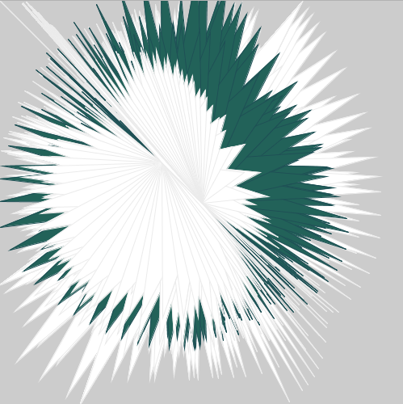
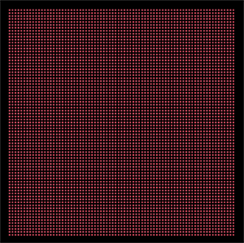
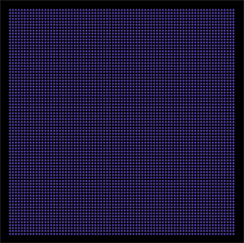
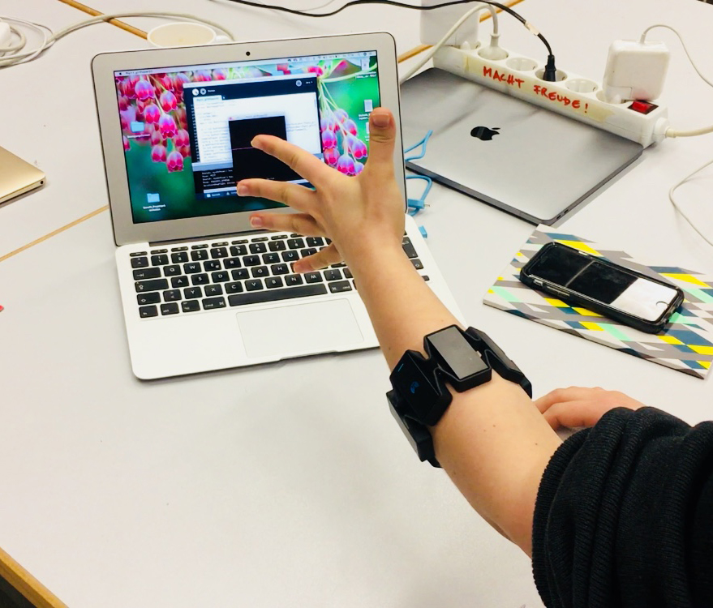

Here you can find my processing-projects with **Processing 3** created at FH Potsdam!:sparkles:

# Project 1: Million Summit Star

 
 With this sketch you can draw a beautiful white star with your mouse, which consists out of triangles. If you keep the mouse pressed, the drawing color changes to green.
    

# Project 2: Disco Dots

 
 This sketch displays a square out of colored dots, which change their color depending on your mouse position.
    

# Project 3: Song Control Wristband

With this sketch you can control your favorite song! Play it, pause it, change the speed by using simple hand gestures while wearing the MYO wristband: https://www.myo.com. 
 
**Connect the wristband, choose your song and control it easily with natural gestures:**  
 
<em>SPREAD FINGERS -> Play music</em> 
<em>FIST -> Pause music</em> 
<em>WAVE IN -> Speed up music</em> 
<em>WAVE OUT -> Slow down music</em> 
<em>DOUBLE TAP -> Keep current pace</em> 
